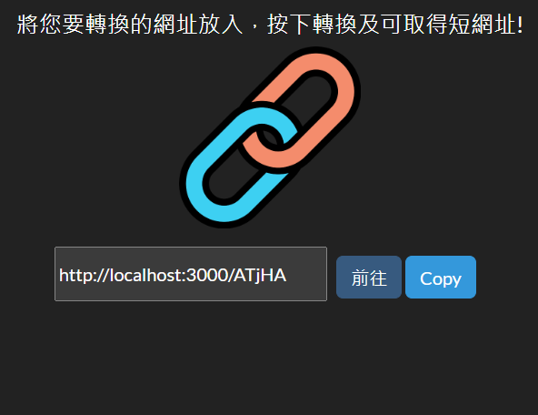

# URL Shortener

## 介紹

使用者可透過此轉換器將網址縮短

## 功能

- 輸入網址並轉換成短網址
- 點擊"複製"按鈕複製網址
- 點擊"前往"按鈕前往該網址
- 可透過短網址轉址到原本網站

## 網頁外觀



## 使用步驟

1. 確認 node.js 與 npm 是否安裝
2. 將專案 clone 到本地資料夾
3. 在本地開啟後，透過終端機進入資料夾，輸入：

   ```bash
   npm install
   ```

4. 安裝完畢後，繼續輸入：

   ```bash
   npm run start
   ```

5. 若看見此行訊息則代表順利運行，打開瀏覽器進入到http://localhost:3000

   ```bash
   Listening on http://localhost:3000
   ```

6. 若要暫停使用

   ```bash
   ctrl + c
   ```

## 開發工具

- Node.js 14.16.0
- Express 4.17.1
- Express-Handlebars 4.0.2
- MongoDB
- mongoose 5.9.7
